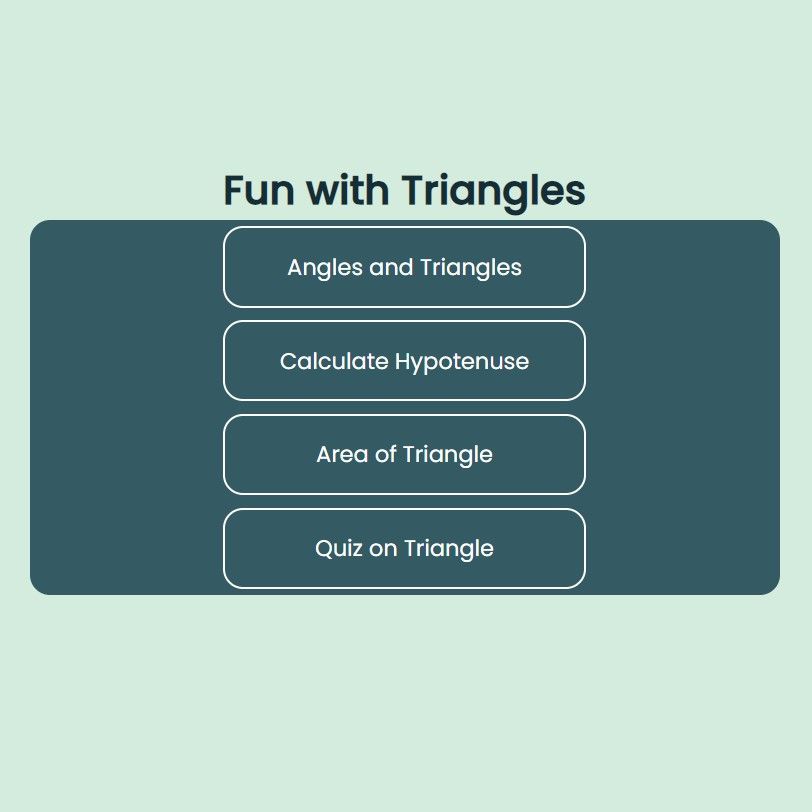

# Fun with Triangles

### Description

###### (levelZero_markTwelve)

The website has the following features:
- To check if three angles form a triangle
- To calculate hypotenuse on the basis of the other two sides
- Calculate the area of a triangle
- Quiz on the triangle





### My Learnings
- React Router -> BrowserRouter, Route, Switch, Link

### Tech Stack

React, CSS

# Installation

```bash
git clone https://github.com/anshulraheja/levelZero_markTwelve.git
npm install
```

CodeSandBox [Link](https://codesandbox.io/s/github/anshulraheja/levelZero_markTwelve)
